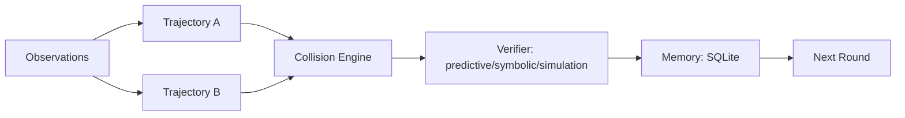

# Project Aletheon - Discovery Collision Theory (DCT) Lab


一个面向**可复现科学发现机制研究**的本地实验框架。  
核心目标是验证：

`双轨发现 (A/B) -> 碰撞合成 (Collision) -> 多模式验证 (Verifier) -> 记忆回写 (Memory)`

是否在受控任务中优于单轨/朴素融合 baseline。

---

## 目录
1. [本次版本重点升级](#本次版本重点升级)
2. [研究定位与边界](#研究定位与边界)
3. [核心架构](#核心架构)
4. [Benchmark 家族](#benchmark-家族)
5. [指标体系](#指标体系)
6. [快速开始](#快速开始)
7. [模型 Provider 配置](#模型-provider-配置)
8. [CLI 使用](#cli-使用)
9. [GUI 控制台使用](#gui-控制台使用)
10. [输出产物与审计](#输出产物与审计)
11. [配置说明](#配置说明)
12. [Ablation 指南](#ablation-指南)
13. [测试与质量保证](#测试与质量保证)
14. [常见问题](#常见问题)
15. [项目结构](#项目结构)
16. [License](#license)

---

## 本次版本重点升级

### 1) GUI Discovery Collider（可自定义向量方向）
- 支持在 UI 手工填写多个 discovery。
- 每个 discovery 可配置 `direction(x,y,z)` 向量方向。
- 系统先做 pair collision scoring，再通过 LLM 生成 collision hypotheses。
- 自动判定候选是否为“新理论”（含 novelty score 与新理论计数）。

### 2) Provider 切换自动补全 Base URL
- 在 Run Launcher 切换 `model_provider` 时，自动填充对应 `Base URL`：
  - OpenAI-compatible 系列 -> `openai_base_url`
  - `anthropic` -> `anthropic_base_url`
  - `gemini` -> `google_base_url`
- 同时自动请求 provider 可用模型列表，并填充：
  - `Model Name`
  - `Reasoner Model Name`

### 3) Experiment Runs 支持 LLM 结果解释（仅在线模式）
- Run Detail 新增 `Explain This Run`。
- 仅当满足以下条件时允许调用：
  - `model_access_mode=online`
  - `allow_remote_inference=true`
  - 使用远程 URL（非 localhost）
- 后端接口：`POST /api/runs/{run_name}/explain`

### 4) 任务进度自动保存
- Run Jobs 状态与日志会自动持久化到：
  - `outputs/.ui_jobs_state.json`
- 控制台刷新/重启后可恢复已完成与历史任务进度。
- 前端同时会本地保存表单与 Collider 草稿状态。

---

## 研究定位与边界

### 本仓库当前可以验证
- DCT 机制在合成、可控、可评分任务上的有效性。
- 碰撞合成是否优于 `A/B` 结果朴素拼接。
- 记忆回写是否改善后续轮次表现。

### 本仓库当前不能宣称
- 不能证明已自动发现现实世界根本科学定律。
- 不能证明已具备跨领域开放世界通用科学自主性。
- 不能证明可直接迁移到高噪声真实工业/科研场景。

---

## 核心架构



### 关键模块
- `dct/agents/trajectory_a.py`：归纳/压缩偏置发现轨迹
- `dct/agents/trajectory_b.py`：机制/反事实偏置发现轨迹
- `dct/agents/collision_engine.py`：A/B 假设碰撞合成
- `dct/agents/verifier.py`：多模式验证
- `dct/orchestration/orchestrator.py`：迭代编排
- `dct/memory/sqlite_store.py`：记忆持久化
- `dct/api/app.py`：Dashboard API + UI

---

## Benchmark 家族

- `symbolic`：符号/布尔/代数规则重建
- `dynamical`：局部转移、图传播、有限状态更新
- `compression`：噪声观测下恢复紧凑表达式
- `real_world_laws`：Kepler-like、pendulum-like 规律重发现
- `autonomy_generalization`：伪相关漂移、尺度变化与机制不变泛化
- `open_world_noise`：异方差噪声、离群点与分布漂移鲁棒性

---

## 指标体系

主报告指标（`method_summaries.csv` / `summary.json`）：

- `validity_rate`
- `heldout_predictive_accuracy`
- `ood_predictive_accuracy`
- `stress_predictive_accuracy`
- `transfer_generalization_score`
- `open_world_readiness_score`
- `rule_recovery_exact_match_rate`
- `compression_score`
- `novelty_score`
- `time_to_valid_discovery`
- `cumulative_improvement`

关键组合公式（代码实现）：

- `transfer_score = 0.5 * predictive + 0.5 * ood`
- `open_world_score = 0.35 * predictive + 0.35 * ood + 0.30 * stress`

---

## 快速开始

### 1) 安装

```bash
cd /Users/lihiko/repo/research/ProjectAletheon

python3.11 -m venv .venv
source .venv/bin/activate
pip install -e '.[dev]'
cp .env.example .env
```

### 2) 本地模型示例（Ollama）

```bash
# Terminal A
ollama serve

# Terminal B
ollama pull deepseek-r1:70b
./.venv/bin/dct check-model
```

### 3) 跑最小实验

```bash
./.venv/bin/dct quickstart
```

---

## 模型 Provider 配置

### OpenAI-compatible 家族
`openai_compatible/openai/xai/deepseek/groq/mistral/together/fireworks/openrouter/ollama/lmstudio/vllm/llamacpp/...`

- 统一使用：
  - `OPENAI_BASE_URL`
  - `OPENAI_API_KEY`

### 原生 API
- `anthropic`
  - `ANTHROPIC_BASE_URL`
  - `ANTHROPIC_API_KEY`
- `gemini`
  - `GOOGLE_BASE_URL`
  - `GOOGLE_API_KEY`

### 访问策略（强约束）
- `MODEL_ACCESS_MODE=local|online`
- 若 Base URL 为远程地址：
  - 必须 `MODEL_ACCESS_MODE=online`
  - 必须 `ALLOW_REMOTE_INFERENCE=true`

---

## CLI 使用

```bash
./.venv/bin/dct --help
./.venv/bin/dct check-model
./.venv/bin/dct run --config config/quickstart.yaml
./.venv/bin/dct run --config config/full_experiment.yaml
./.venv/bin/dct run --config config/openworld_pathfinder.yaml
./.venv/bin/dct openworld
```

在线 API 示例（OpenAI）：

```bash
./.venv/bin/dct run \
  --config config/quickstart.yaml \
  --model-provider openai \
  --model-access-mode online \
  --allow-remote-inference \
  --openai-base-url https://api.openai.com/v1 \
  --openai-api-key "$OPENAI_API_KEY" \
  --model-name gpt-5-mini
```

---

## GUI 控制台使用

### 启动

```bash
./.venv/bin/dct serve --output-root outputs --host 127.0.0.1 --port 8000
```

打开：`http://127.0.0.1:8000/`

### Run Launcher
- 选择 mode/provider/model。
- Provider 切换时会自动补齐对应 Base URL。
- Provider/base-url/key 变化后会自动拉取可用模型，供 `Model Name` 与 `Reasoner Model Name` 选择（仍可手动输入）。
- 支持 reasoner 开关与模型名覆盖。

### Experiment Runs
- 查看 method summary、uplift、plots、artifacts。
- 使用 `Explain This Run` 触发在线 LLM 解释：
  - 仅在线远程 provider 可用。

### Realtime Model Stream
- 查看 job 运行日志与模型原始输出流。

### Discovery Collider（新增）
- 新增独立标签页。
- 填写多个 discovery（表达式、置信度、向量方向）。
- 通过 LLM collision 生成新候选理论。
- 返回 `is_new_theory`、`novelty_score`、`new_theory_count`。

### 进度自动保存（新增）
- job 进度自动写入 `outputs/.ui_jobs_state.json`。
- 前端状态（表单、当前选择、collider 草稿）自动保存并恢复。

### Verifier 鲁棒门控（新增）
- 在 `predictive/symbolic/simulation` 基础上，新增 OOD/Stress 鲁棒性门控。
- 判定逻辑：核心三模式通过后，还需满足 OOD/Stress 阈值（若对应数据集存在）。
- 可在 task `metadata` 覆盖阈值：
  - `ood_pass_threshold`
  - `stress_pass_threshold`

---

## 输出产物与审计

每次运行输出目录：

`<output_dir>/<run_name>/`

关键文件：
- `summary.json`
- `method_summaries.csv`
- `candidate_logs.csv`
- `round_summaries.jsonl`
- `plots/*.png`

默认记忆库：
- `outputs/dct_memory.db`

---

## 配置说明

### `.env`（运行时）
- `MODEL_PROVIDER`
- `MODEL_ACCESS_MODE`
- `ALLOW_REMOTE_INFERENCE`
- `OPENAI_BASE_URL`
- `OPENAI_API_KEY`
- `ANTHROPIC_BASE_URL`
- `ANTHROPIC_API_KEY`
- `GOOGLE_BASE_URL`
- `GOOGLE_API_KEY`
- `MODEL_NAME`
- `MODEL_TEMPERATURE`
- `MODEL_TIMEOUT_SECONDS`
- `DCT_OUTPUT_DIR`
- `DCT_SQLITE_PATH`
- `DCT_CHECK_MODEL_ON_START`

### YAML（实验）
- `seed`
- `trials`
- `rounds`
- `hypotheses_per_trajectory`
- `baselines`
- `benchmark_families`
- `samples_per_task_train`
- `samples_per_task_heldout`
- `verifier_modes`
- `ablation.*`
- `output_dir`

---

## Ablation 指南

```yaml
ablation:
  no_collision: false
  no_memory_write_back: false
  no_verifier: false
  single_verifier_mode_only: null
```

常见组合：
- 禁用碰撞：`no_collision: true`
- 禁用记忆回写：`no_memory_write_back: true`
- 禁用验证器：`no_verifier: true`
- 单验证模式：`single_verifier_mode_only: predictive`

---

## 测试与质量保证

```bash
./.venv/bin/pytest -q
```

覆盖范围包括：
- benchmark 生成
- provider 路由与 JSON 鲁棒性
- collision / verifier 逻辑
- orchestrator 端到端（fake provider）
- API + UI 接口
- 新增：run explain / discovery collide / jobs 持久化

---

## 常见问题

### `dct` 命令找不到
使用：

```bash
./.venv/bin/dct quickstart
```

或：

```bash
./.venv/bin/python -m dct.cli quickstart
```

### 模型不可达
先执行：

```bash
./.venv/bin/dct check-model
```

再检查 provider 对应的 base URL / API key / access mode 配置。

### 在线解释按钮不可用
请确认：
- `model_access_mode=online`
- `allow_remote_inference=true`
- Base URL 不是 `localhost/127.0.0.1`

---

## 项目结构

```text
.
├── dct/
│   ├── agents/
│   ├── benchmarks/
│   ├── llm/
│   ├── memory/
│   ├── orchestration/
│   ├── reporting/
│   ├── api/
│   ├── ui/
│   ├── prompts/
│   ├── cli.py
│   └── config.py
├── config/
├── tests/
├── reports/
└── README.md
```

---

## License

MIT License. See `LICENSE`.
